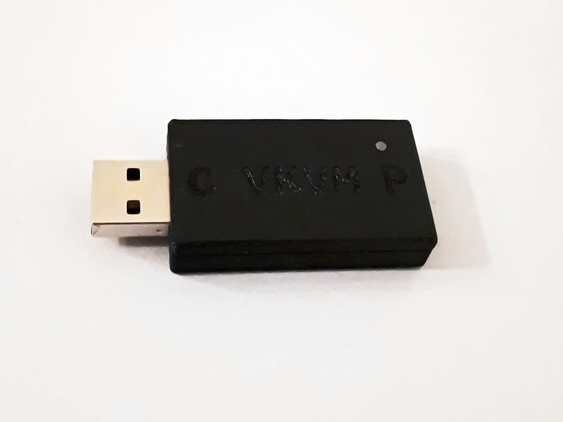
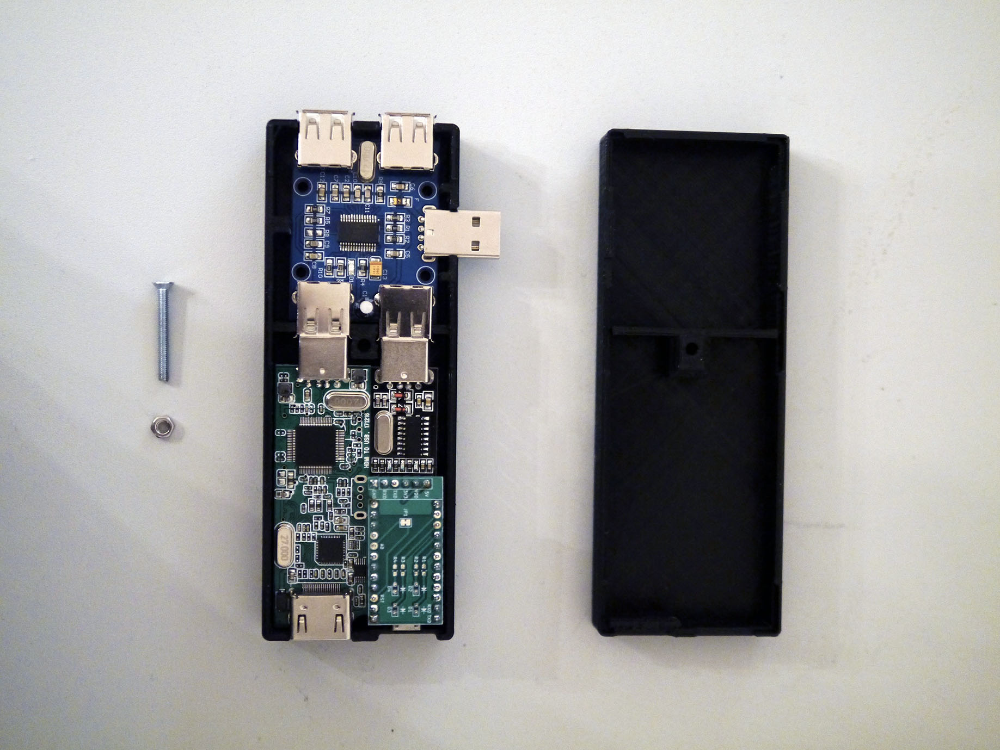
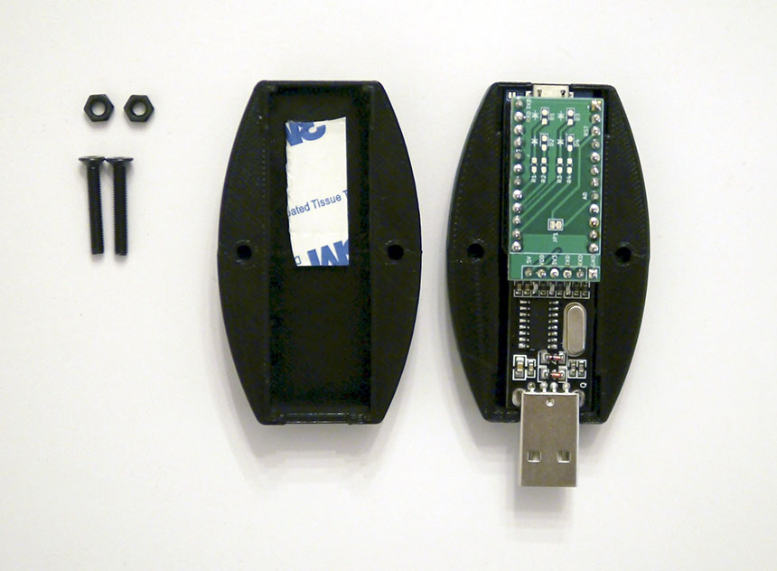
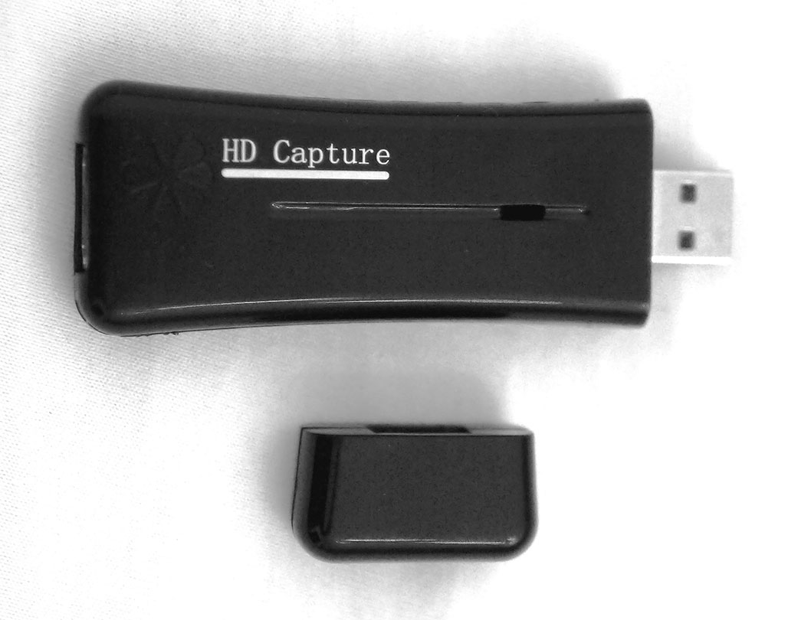
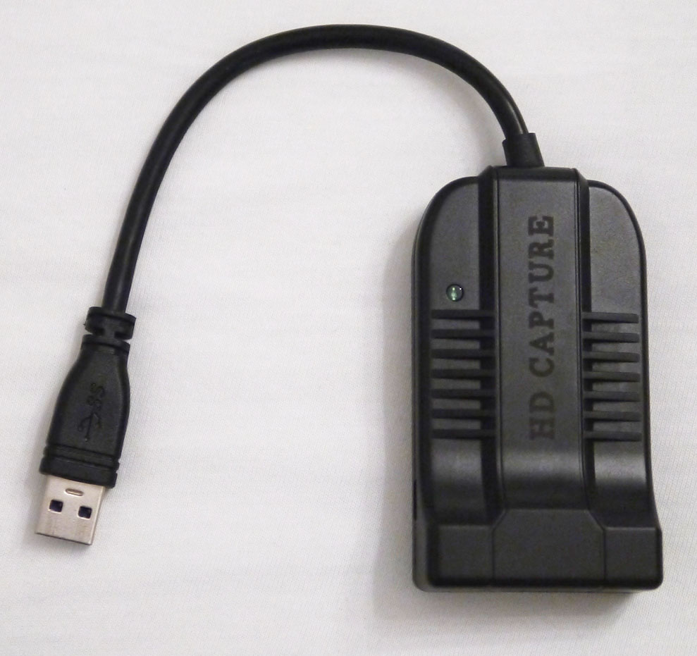
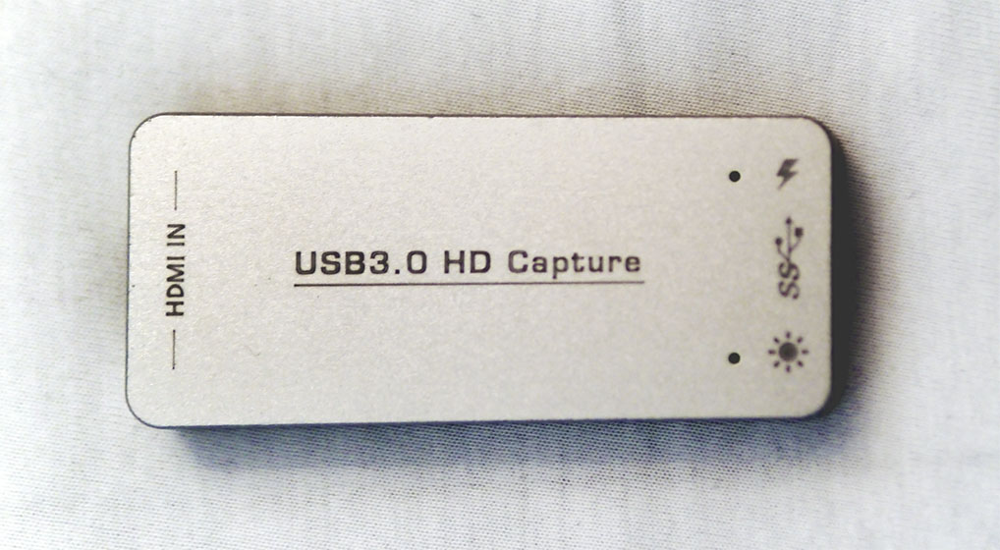
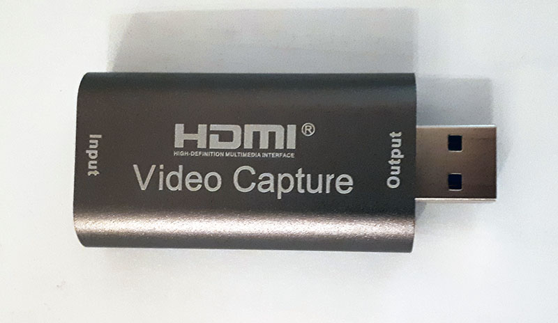
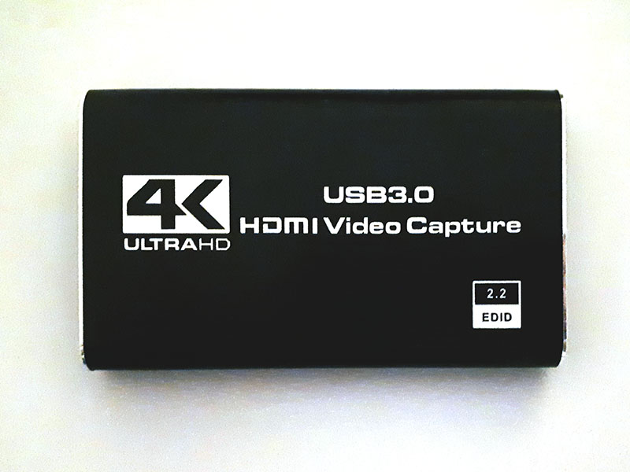
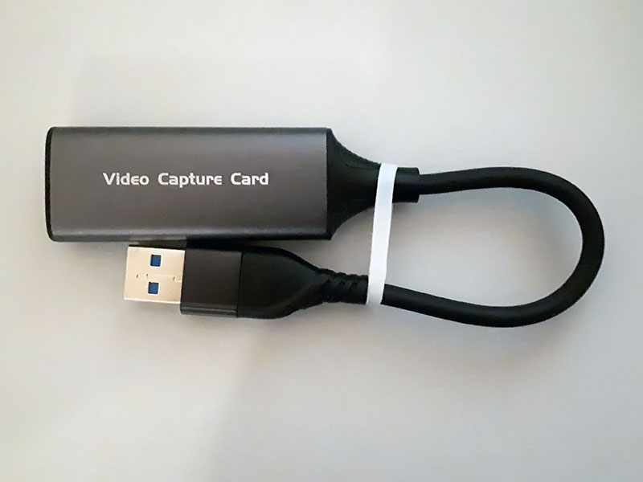
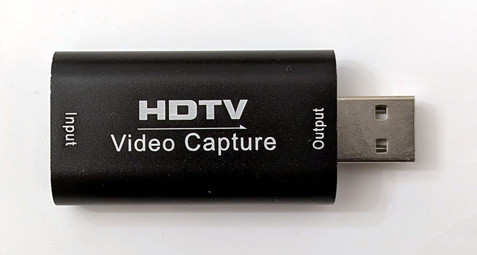

Hardware
========

VKM
----

### PCB

The VKVM periphery to control keyboard and mouse of the periphery can be ordered using the provided
Gerber and placement or KiCAD files. It is recommended to use the latest hardware version for full
function support.

- [KiCAD](../hw/vkm-c)
- [Gerber, BOM and placement](../hw/vkm-c/jlcpcb) for orders at [JLCPCB](https://jlcpcb.com/)
  - USB-A (J4) needs to be soldered by hand (may be required to sand a bit off from the PCB side)
  - The pin headers J2 (ST-Link) and J3 (UART) are optional.

**Important:** Be sure that the USB connectors are fully inserted and aligned when soldering.
Especially when handling the USB-A plug (J4). The plastic pins of the USB-A plug may need to be
removed to accomplish this depending on the actual component type.

Use the following parameters when ordering the PCB. Note that the values have only been tested with JLCPCB.
- layers: 2
- base material: FR4
- dimensions: 35.8x18.5mm
- thickness: 1mm
- surface finish: lead free HASL
- impedance control: no
- outer copper weight: 1oz

With no special extras.

### Connectors

- J1 shall be connected to the remote periphery.
- J2 is used for debugging and firmware upload.
- J3 is used for tracing.
- J4 shall be connected to the controller.
- The 3D printed connector housings [stlink-conn-A.stl](../hw/vkm-c/stlink-conn-A.stl) and [stlink-conn-B.stl](../hw/vkm-c/stlink-conn-B.stl)
  can be used to connect J2 to a Chinese [ST-Link/V2 clone](https://stm32world.com/wiki/DIY_STM32_Programmer_(ST-Link/V2-1)).
  Just glue them to jumper cables with the correct pin out.

### Wiring

Wiring for debugging/tracing via ST-Link/V2.

|VKVM  |ST-Link/V2 |Target               |
|------|-----------|---------------------|
|RESET |RST        |Controller           |
|BOOT  |-          |Controller           |
|SWDIO |SWDIO      |Controller           |
|SWCLK |SWCLK      |Controller           |
|GND   |GND        |Controller/Periphery |
|SWCLK |SWCLK      |Periphery            |
|SWDIO |SWDIO      |Periphery            |
|BOOT  |-          |Periphery            |
|RESET |RST        |Periphery            |

### Case

The case can be 3D printed in for example in PLA.  
Pre-created STL files for the variant without any pin header are included.
- [case-bottom.stl](../hw/vkm-c/case-bottom.stl)
- [case-top.stl](../hw/vkm-c/case-top.stl)

Tolerance can be adjusted to match the one of the printer using the spreadsheet within the included FreeCAD file.
This also includes cases for board variants with pin header.
- [case.FCStd](../hw/vkm-c/case.FCStd)

Use the given orientation for printing and the following parameters:
- layer height: 0.2mm
- infill: ≥15%
- solid layers: ≥5 top, ≥4 bottom
- perimeters: ≥3
- supports: none

Insert a transparent 1.75mm filament into the LED hole and cut it off at the case top edge. This acts as light guide.
Note that both sides of the case should just snap together. No glue is required.

### Firmware Upload

The firmware can be uploaded via J2 using an ST-Link/V2 programmer or
by DFU upload at the first time with no firmware uploaded yet. Later
can be done by connecting each of the VKM USB connects once to the PC
and choosing DFU as upload method. Later uploads require an ST-Link/V2
programmer or similar device.

### Older Variants

Previous attempts to design a VKM device have been made and are listed here for reference.

#### Variant 1

Parts used:
- [HDMI Capture Variant 1](hdmi-cap1.md)
  - The board inside was reused without the housing.
- 4-Port USB2.0 Extension Board Module
  - https://www.aliexpress.com/item/4001031421760.html
  - https://www.aliexpress.com/item/4000355651437.html
  - https://www.aliexpress.com/item/1005003614172238.html
  - https://www.amazon.com/dp/B09P4899CF
- USB-A to TLL CH340G Module with modified pin header
  - https://www.aliexpress.com/item/4000120687489.html
  - https://www.aliexpress.com/item/4000120687489.html
  - https://www.amazon.com/dp/B09MKW6ZQ8
- TTL to Arduino ProMicro Board with Isolation
  - [PCB](../hw/ser)
- Short Arduino ProMicro
  - https://www.aliexpress.com/item/1005003717649243.html
  - https://eu.robotshop.com/products/cytron-arduino-pro-micro-compatible-w-pre-soldered-headers
  - https://www.amazon.com/dp/B09C5H78BP
- 3D printed case
  - [FreeCAD](../res/Case.FCStd)
  - [STL part A](../res/CaseA.stl)
  - [STL part B](../res/CaseB.stl)
- 1x 24..25mm M3 screw with nut

#### Variant 2

This is basically variant 1 without the HDMI capture device included.  
Parts used:
- 4-Port USB2.0 Extension Board Module
  - see variant 1
- USB-A to TLL CH340G Module with modified pin header
  - see variant 1
- TTL to Arduino ProMicro Board with Isolation
  - [PCB](../hw/ser)
- Short Arduino ProMicro
  - see variant 1
- 3D printed case
  - [FreeCAD](../res/Case.FCStd)
  - [STL part A](../res/SmallCaseA.stl)
  - [STL part B](../res/SmallCaseB.stl)
- 2x 22mm M3 screw with nuts

Video Capture Devices
---------------------

The following variants have been tested.

- [HDMI Capture Variant 1](hdmi-cap1.md)  
  
- [HDMI Capture Variant 2](hdmi-cap2.md)  
  
- [HDMI Capture Variant 3](hdmi-cap3.md)  
  
- [HDMI Capture Variant 4](hdmi-cap4.md)  
  
- [HDMI Capture Variant 5](hdmi-cap5.md)  
  
- [HDMI Capture Variant 6](hdmi-cap6.md)  
  
- [HDMI Capture Variant 7](hdmi-cap7.md)  
  
