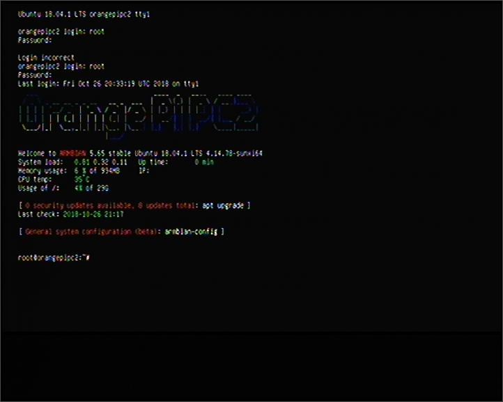

HDMI Capture Variant 1
======================

Available at AliExpress.com:
* https://www.aliexpress.com/item/4000007234729.html
* https://www.aliexpress.com/item/33054049749.html
* https://www.aliexpress.com/item/32996784167.html
* https://www.aliexpress.com/item/33007122036.html

Little heat buildup at full resolution and frame rate. No HD output (only input).  
Seems to use an HDMI to S-Video to USB converter internally.  
Contrast, brightness and other values are not optimal set by default and need to be adjusted for an optimal image.  
Chip: HD DVR1997 1824N 7AJP47457.000 BPM583.8  
**Caution: This device has no UVC/UVA support and needs special capture drivers usually found on the included CD.**  

**On Windows 7:**  
Monitor (HDMI connection) is detected as `HDMI` with `AGO0001` (1920x1080, 1024x768 recommended).  
Capture device (USB connection) is detected as `usbtv007` with `USB\VID_1B71&PID_3002&REV_0100` for video and audio.

Product Description
===================

HD Video Capture Card, USB 2.0 HDMI Video Capture Cards Accessories For Computer

Features:
* HDMI input resolution: 720x480 (30p), 720x576 (30p), 1280x720p (30P), 1280x720p (30p) 1920x1080 pixels at 30x, 1920x1080 pixels at 30P.
* Accord with Universal Serial Bus Specification Version 2.0.
* HDMI output 720 * 576 (50p).
* Video input: HDMI; Audio input: HDMI.
* Premium material guarantees a everlasting durability.

Specifications:

|Parameter             | Value
|----------------------|------------------
|Type                  |Video capture card
|Color                 |Black
|USB                   |USB 2.0
|HDMI input resolution |720x480 (30p), 720x576 (30p), 1280x720p (30P), 1280x720p (30p) 1920x1080 pixels at 30x, 1920x1080 pixels at 30P.
|Video/audio input     |HDMI
|Dimension             |8.7x3.1x1.3cm

System Requirement:
* P4 1.7GHz or higher.
* 256MB RAM.
* 32Mb VGA memory.
* USB2.0 port.
* Supports Windows XP/Vista/7/8/10 

Package list:
* 1x USB 2.0 HDMI Video Capture Card
* 1x Quick Start Guide
* 1x Software CD 

Sample Output
=============

