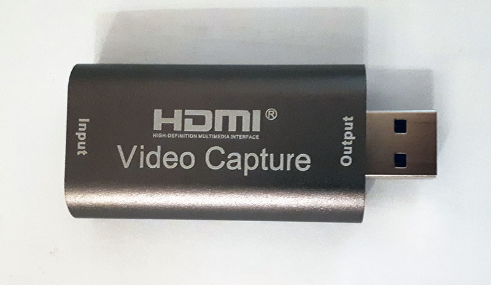

HDMI Capture Variant 4
======================

Available at AliExpress.com:
* https://www.aliexpress.com/item/1005001382235274.html
* https://www.aliexpress.com/item/1005005709766777.html
* https://www.aliexpress.com/item/1005005709924119.html
* https://www.aliexpress.com/item/1005005709924119.html

Supports plug and play with a UVC and UVA compatible USB capture interface.

**On Windows 7:**  
@todo: Monitor (HDMI connection) is detected as `HJW1836` with `MACROSILICON` (4096x2160, 1280x720 recommended).  
Capture device (USB connection) is detected as `USB Video` with `USB\VID_534D&PID_2109&REV_2100&MI_00` for video and `USB\VID_534D&PID_2109&REV_2100&MI_02` for audio.

Description
===========

The HD vedio capture card can capture HD vedio and audio at the same time.
USB 3.0 video converter transmit vedio and audio to the computer and smart phone to store it.
The HD 1080P audio recorder device supports 60fps and USB3.0, VLC, OBS,,Amcap.
The 60fps audio recorder can used to capture hd collection, teaching recording and medical image.
HD video converter surpports, replacement for Windows/replacement for Android/replacement for MacOS, so that it can be used widely.

Specification:

|Parameter                  | Value
|---------------------------|------------------------------------------
|HD resolution              |3840x2160@60Hz
|Video input format         |8/10/12 bit color depth
|Video output mode          |YUV, JPEG
|Video output resolution    |1920x1080@60Hz
|Support audio format       |L-PCM
|Input cable length         |≤15m, AWG26 HD cable
|Maximum working current    |0.4A/5VDC
|Operating temperature range|-10 to +55°C
|Size                       |64x28x13mm
|Weight                     |21.4g

Package included:
* 1x capture card
