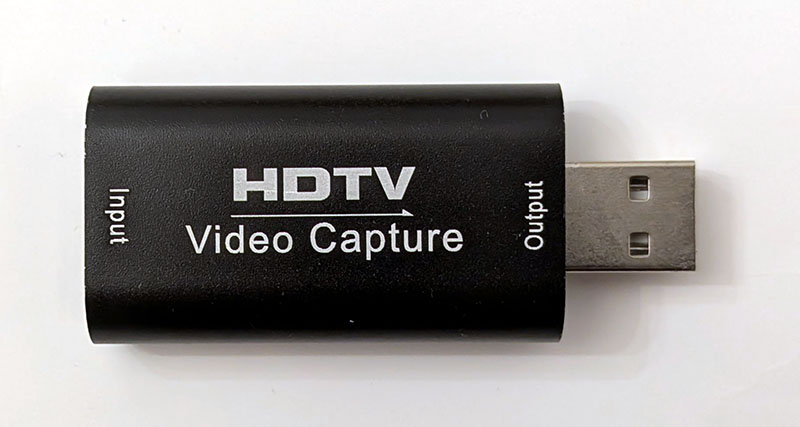

HDMI Capture Variant 7
======================

Available at AliExpress.com:
* https://www.aliexpress.com/item/1005006599533634.html
* https://www.aliexpress.com/item/1005006890646282.html
* https://www.aliexpress.com/item/1005006825608006.html

Supports plug and play with a UVC and UVA compatible USB capture interface.

**On Windows 7:**  
Monitor (HDMI connection) is detected as `1. MACROSILICON` with `HJW1836` (4096x2160, 1280x720 recommended).  
Capture device (USB connection) is detected as `USB Video` with `USB\VID_534D&PID_2109&REV_2100&MI_00` for video and `USB Digital Audio` with `USB\VID_534D&PID_2109&REV_2100&MI_02` for audio.

Description
===========

4K USB3.0 USB2.0 Audio Video Capture Card HDMI To USB 3.0 2.0 Acquisition
Card Live Streaming Plate Camera Switch Game Recording video capture can
capture both HDMI video and HDMI audio, sending audio and video signals to
computers and smart phones for preview and storage. Suitable for high
definition acquisition, teaching recording, medical imaging, etc.

Feature
-------

* Support input max resolution 3840×2160@30Hz;
* Support output max resolution 1920×1080@30Hz/60Hz;
* Support 8/10/12bit deep color;
* Support AWG26 HDMI standard cable: input up to 15 meters, (1080P and below resolution);
* Support most acquisition software, such as VLC, OBS, Amcap, etc;
* Support for Windows、Android and MacOS;
* Conform to USB Video and for UVC standard;
* Conform to USB Audio for UAC standard;
* Without external power supply, compact and portable.

Specifications
--------------

|Parameter                   | Value
|----------------------------|-----------------------------------------------------
|HDMI resolution             |Max input can be 3840×2160@30Hz
|Support video format        |8/10/12bit Deep color
|Video output format         |YUV, JPEG
|Video output resolution     |Max output can be 1920×1080@30Hz/60Hz
|Support audio format        |L-PCM
|Input cable distance        |≤15m, AWG26 HDMI standard cable
|Max working current         |0.4A/5VDC

Connection and Operation
------------------------

1. Connect the UHD signal source to the HDMI input of the video capture with one HDMI cable.
2. Connect the computer to the usb port of the video capture with usb cable.
3. Operation steps for USB video capture(OBS): Open the software→Choose sources of
   "Video capture Device" → Set the size of image → Choose "Studio Mode" (double window) → Choose "Start Recording".

Operation Example as below
1. Add new sources, choose "Nsendato Video Capture Device"
