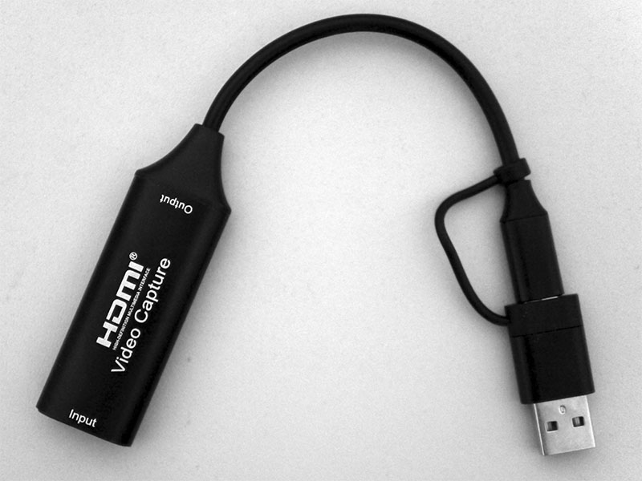

HDMI Capture Variant 8
======================

Available at AliExpress.com:
* https://www.aliexpress.com/item/1005009379106163.html
* https://www.aliexpress.com/item/1005010107915473.html

Supports plug and play with a UVC and UVA compatible USB capture interface.

**On Windows 7:**  
Monitor (HDMI connection) is detected as `HD TO USB` with `HJW2109` (4096x2160, 1280x720 recommended).  
Capture device (USB connection) is detected as `USB Video` with `USB\VID_345F&PID_2109&REV_2100&MI_00` for video and `USB Digital Audio` with `USB\VID_345F&PID_2109&REV_2100&MI_02` for audio.

Description
===========

The video capture can capture both HDMI-compatible video and HDMI-compatible audio,
sending audio and video signals to computers and smart phones for previews and storage.
Suitable for high definition acquisition, teaching recording, medical imaging, etc.

Feature
-------

* Support input max resolution 4K@30Hz;
* Support output max resolution 1080P@60Hz;
* Support 24/30/36bit deep color;
* Support AWG26 HDMI-compatible standard cable: input up to 15 meters, (1080P and below resolution);
* Support most acquisition software, such as VLC, OBS, Amcap, etc;
* Support Windows, Android and MacOS;
* Conform to USB Video and UVC standard;
* Conform to USB Audio UAC standard;
* Support uncompressed(YUY2 1080P@60Hz) acquisition (USB3.0);
* No need external power supply, compact and portable.

Specifications
--------------

|Parameter                   | Value
|----------------------------|-------------------------------
|HDMI resolution             |Max input can be 3840x2160@30Hz
|Support video format        |8/10/12bit Deep color
|Video output format         |YUV, JPEG
|Video output resolution     |Max output can be 1920x1080@60Hz
|Support audio format        |L-PCM
|Input cable distance        |≤15m, AWG26 HDMI standard cable
|Max working current         |0.4A/5VDC
|Operating Temperature range |(-10 to +55°C)
|Dimension (L x W x H)       |64x28x13 (mm)
|Weight                      |21.4g

Connection and Operation
------------------------

1. Connect the UHD signal source to the HDMI input of the video capture with
   one HDMI cable.
2. Connect the computer to the usb port of the video capture with usb cable.
3. Operation steps for USB video capture (OBS): Open the software→Choose
   source of "Video capture Device"→Set the size of image→Choose "Studio
   Mode"(double window)  Choose "Start Recording".
   Operation Example as below
