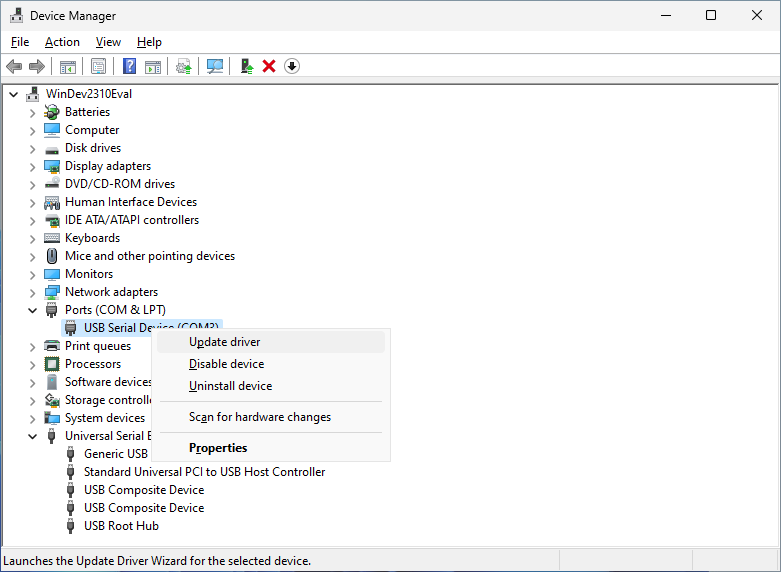
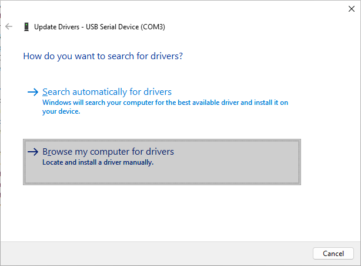
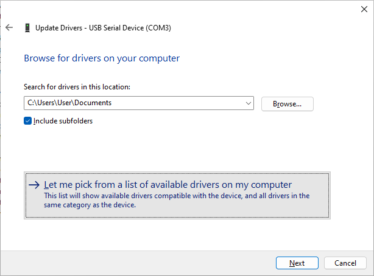
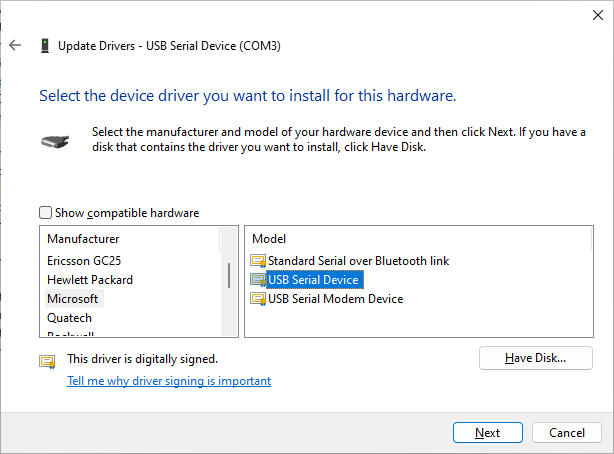
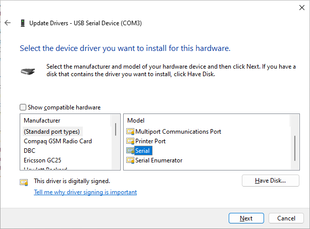

Windows: VKVM Control Driver Installation
=========================================

The controller side of the VKVM periphery may require the user to install a driver.
The default USB VID/PID is treated as Arduino Leonardo and is automatically available
if the [Arduino IDE](https://www.arduino.cc/en/software) has been installed.

At its base it used a standard USB CDC/ACM interface for which Windows already offers the
right device driver. Follow the following steps to assign it manually to the VKVM periphery
controller side without any additional software being required.

1. Open the device manager. E.g. press WIN+R and run `devmgmt.msc`.
   Right click on the new device and select "Update driver".  
   
2. Choose "Browse my computer for drivers".  
   
3. Choose "Let me pick from a list of available drivers on my computer".  
   
4. Clear "Show compatible hardware" and select "USB Serial Device" or a similar entry
   from "Microsoft". Other serial device drivers like from Prolific may also work.  
   
5. For example "Serial" from "(Standard port types)".  
   
6. Press "Next" to finish the driver installation.

This example applies to Windows 11 and is similar with other Windows versions.
